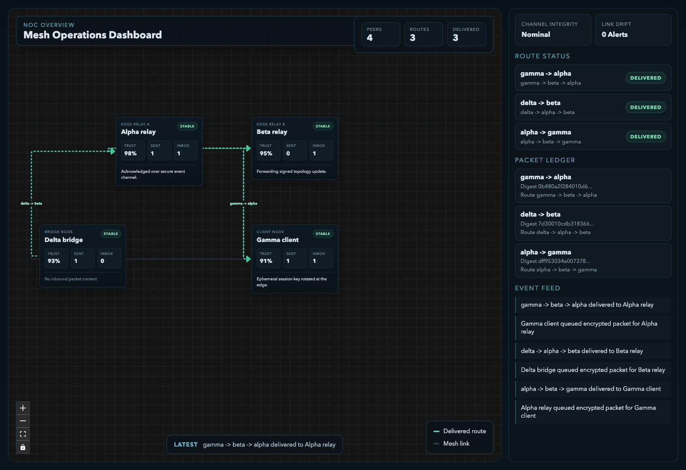

# harness-0

Browser-based mesh network dashboard built with React Flow and MobX State Tree. It simulates encrypted packet routing between browser peers over in-memory event channels and renders the topology in a network-ops style UI.

Live site: https://geoffsee.github.io/harness-0/



## Development

```bash
bun install
bun run dev
```

Runs the Vite dev server with hot reload at `http://localhost:4173`.

## Production Build

```bash
bun run build
```

Builds the production site into `dist/`.

## Deployment

GitHub Pages is deployed through GitHub Actions using `.github/workflows/deploy-pages.yml`. Configure the repository Pages source to `GitHub Actions`.

## Project Structure

- `src/App.tsx` - dashboard layout and React Flow graph
- `src/meshNetwork.ts` - mesh model, routing, encryption, and packet state
- `src/index.tsx` - frontend entrypoint
- `build.ts` - production bundling and static HTML generation
- `vite.config.ts` - local dev server configuration

## Notes

- `mobx-state-tree` drives the simulated network state
- `@xyflow/react` renders the topology and packet routes
- Web Crypto is used for browser-side packet encryption
- The transport layer is simulated in-browser for visualization, not real networking
